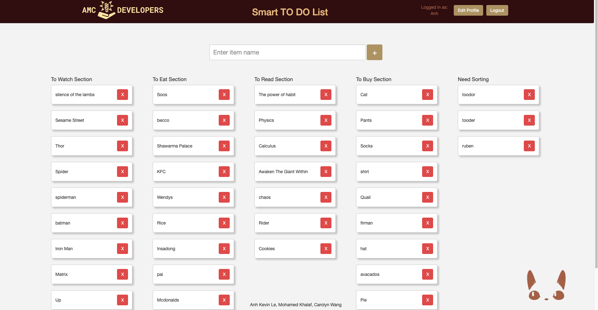
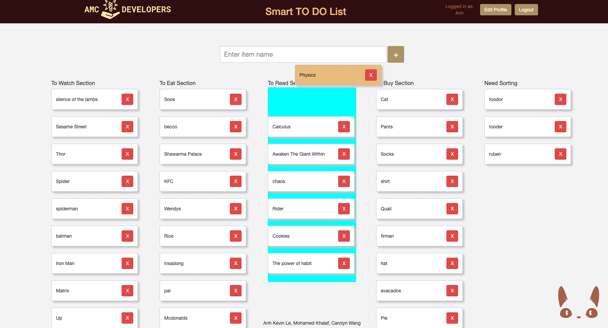
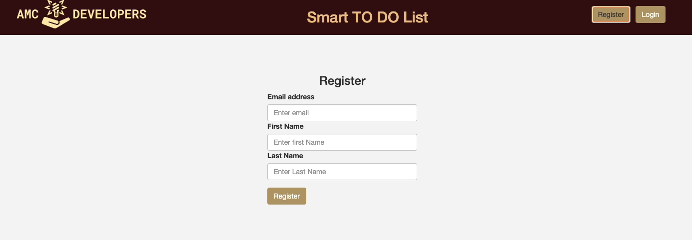
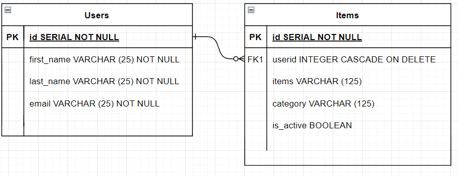

# SMART TO-Do-List
=========

## Description

This is a full-stack single page application that intelligently sorts out user inputs into the correct to-do-list based on past sorting and aggragated data.

## Screenshots

### Landing page

### Smart List

### Drag and Drop to re-categorize

### Login

### register

### register

## Getting Started

1. Create the `.env` by using `.env.example` as a reference: `cp .env.example .env`
2. Update the .env file with your correct local information 
  - username: `labber` 
  - password: `labber` 
  - database: `midterm`
3. Install dependencies: `npm i`
4. Fix to binaries for sass: `npm rebuild node-sass`
5. Reset database: `npm run db:reset`
  - Check the db folder to see what gets created and seeded in the SDB
7. Run the server: `npm run local`
  - Note: nodemon is used, so you should not have to restart your server
8. Visit `http://localhost:8080/`

## Dependencies

- Node 10.x or above
- NPM 5.x or above
- PG 6.x
- cookie-parser
- dotenv
- express
- morgan
- pg
- sass

